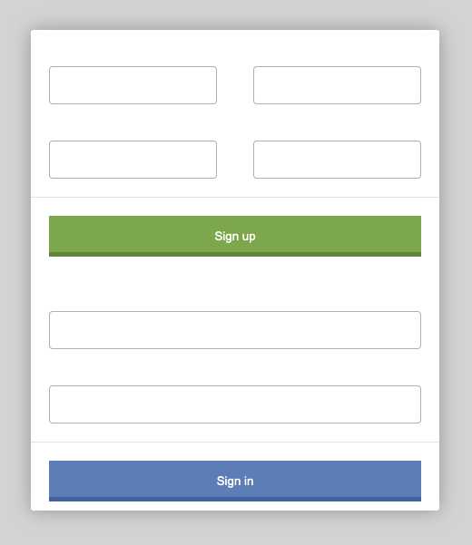
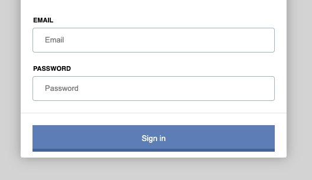

1. Replace `<your_account>` with your Github username in the link
    - [DEMO LINK](https://associate2coder.github.io/js_task_fix_form_DOM/)
2. Follow [this instructions](https://mate-academy.github.io/layout_task-guideline/)
    - Run `npm run test` command to test your code;
    - Run `npm run test:only -- -n` to run fast test ignoring linter;
    - Run `npm run test:only -- -l` to run fast test with additional info in console ignoring linter.

### Task: Auth form fix

Look at this form... Looks like something is missing here. Labels? Placeholders? Yeah..

Your task is to make script, which fixes problems in this form.
1) Add `<label>` for inputs.
2) Add placeholders for each input.

Rely on the `name` of the input when writing your script.

You can read about placeholders and labels here:
- [MDN Placeholder attribute](https://developer.mozilla.org/en-US/docs/Web/HTML/Element/Input#attr-placeholder)
- [MDN Label tag](https://developer.mozilla.org/en-US/docs/Web/HTML/Element/label)

##### Steps to do this challenge:
1) Get all `inputs` from `form` tag on the page.
2) For each `input` element create element `label` with `class` `field-label` (it is needed to apply css styles) and `for` attribute where set `id` of current input. Set `textContent` for label rely on `input` name.
3) For each `input` set `placeholder` based on `input` name. Capitalize it.
4) Append `label` elements to the parent container of `input` (do not wrap inputs into the label in this task)
5) Done.

Hints: p.2 and p.4 can be done in one loop

Do not change styles or HTML layout in this task. Change only `main.js` file.

Expected result:

